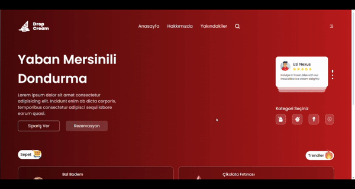

# Dondurma Sitesi

Bu proje, kullanıcıların dondurma ürünlerini tercihlerine göre seçip, sepetlerine ekleyebilecekleri bir alışveriş sitesidir. React, React Router DOM ve Redux Toolkit kullanılarak geliştirilmiş olup, ürün verileri JSON Server üzerinden API ile çekilmektedir. Kullanıcılar, ürünleri külah ya da kupa seçeneği ile tercih edebilir ve sepetlerinde miktar ayarlamaları yapabilir.

## İçindekiler
- [Özellikler](#özellikler)
- [Kullanılan Teknolojiler](#kullanılan-teknolojiler)
- [Kurulum](#kurulum)
- [Kullanım](#kullanım)
- [Projede Kullanılan Komutlar](#projede-kullanılan-komutlar)
- [Ekran Görüntüsü](#ekran-görüntüsü)
- [Katkıda Bulunma](#katkıda-bulunma)
- [Lisans](#lisans)

## Özellikler

- **Ürün Seçimi ve Sepet İşlemleri:** Kullanıcılar, dondurma ürünlerini kupa veya külah seçenekleriyle tercih ederek sepete ekleyebilir.
- **Sepet Yönetimi:** Sepet içerisindeki ürünlerin miktarını artırıp azaltabilir veya tamamen kaldırabilirler.
- **Redux ile Durum Yönetimi:** Uygulamanın tüm durum yönetimi Redux Toolkit kullanılarak yapılmaktadır.
- **Dinamik Yapıların Test Edilmesi:** Projenin dinamik yapıları için birim testler yazılmış ve başarıyla tamamlanmıştır.
- **Kullanıcı Dostu Arayüz:** Basit ve kullanıcı dostu bir alışveriş deneyimi sunar.

## Kullanılan Teknolojiler

- **React** - UI bileşenleri oluşturmak için
- **Redux Toolkit** - Durum yönetimi
- **React Router DOM** - Çoklu sayfa yönlendirmeleri
- **JSON Server** - API ve veri kaynağı
- **Jest** - Unit test framework’ü
- **Testing Library** - React bileşenlerinin test edilmesi

## Kurulum

Projeyi çalıştırmak için aşağıdaki adımları izleyin:

1. Bu projeyi bilgisayarınıza klonlayın:
   ```bash
   git clone https://github.com/cengo14/react-icecream-app-project.git
   ```

2. Proje dizinine gidin:
   ```bash
   cd react-icecream-app-project
   ```

3. Gerekli bağımlılıkları yükleyin:
   ```bash
   npm install
   ```

4. JSON Server'ı başlatın:
   ```bash
   npm run server
   ```

5. Projeyi başlatın:
   ```bash
   npm start
   ```

`http://localhost:3000` adresine giderek uygulamayı görüntüleyebilirsiniz.

## Kullanım

1. **Ürün Seçimi:** Liste sayfasından dondurma ürünlerini külah ya da kupa seçeneği ile tercih edebilirsiniz.
2. **Sepete Ekleme:** İlgili ürünü seçtikten sonra sepete ekleyebilirsiniz.
3. **Sepet Yönetimi:** Sepet modalında ürün miktarını artırabilir, azaltabilir veya ürünü tamamen kaldırabilirsiniz.

## Projede Kullanılan Komutlar

- **Proje Başlatma:** `npm start` - Projeyi yerel sunucuda başlatır.
- **Test Çalıştırma:** `npm test` - Unit testleri çalıştırır.
- **Build:** `npm run build` - Projeyi production için derler.

## Ekran Görüntüsü

Uygulamanın bir ekran görüntüsü aşağıda verilmiştir:



## Katkıda Bulunma

Bu projeye katkıda bulunmak isterseniz, lütfen bir **pull request** açın veya bir **issue** açarak önerilerinizi paylaşın.

## Lisans

Bu proje [MIT Lisansı](https://opensource.org/licenses/MIT) ile lisanslanmıştır.
